# message-push 多通道消息推送服务

流程：



支持推送通道：

    - 微信公众号/测试号
    - 企业微信webhook机器人
    - 钉钉webhook机器人
    - 飞书webhook机器人
    - email
    - 智能音箱（待定）

项目结构：

```
├── api //service api
├── common  //global util
│   └── sender  //all message sender
├── bootstrap  //projrct config init
├── doc 
├── model   //struce(like oop model)
│   ├── constant    //
│   └── r   //unified return model
├── router
├── service
├── view
│   ├── static
│   │   ├── css
│   │   ├── fonts
│   │   ├── img
│   │   ├── js
│   │   └── module
│   └── templates
├── config.ini //config file
├── main.go //starter
```